# Demo IoT Industria 4.0

Projeto demonstrativo com ESP32 simulado no Wokwi, broker MQTT local, InfluxDB local e frontend React em tempo real.

## Arquitetura

```text

```

## Pastas

```text
backend/   API, MQTT subscriber/publisher, InfluxDB e Socket.IO
broker/    Broker MQTT local em Python
frontend/  Login e dashboard IoT em React
influxdb/  InfluxDB local com UI web
wokwi/     sketch.ino e diagram.json da simulacao ESP32
```

## Executar InfluxDB local

Primeira instalacao:

```powershell
cd influxdb
.\install.ps1
```

Iniciar:

```powershell
cd influxdb
.\start.ps1
```

A interface web fica em:

```text
http://localhost:8086
```

Login:

```text
usuario: admin
senha: adminadmin
```

O InfluxDB 2.x rejeita senhas com menos de 8 caracteres, por isso `admin` nao e aceito como senha.

## Executar broker local

```bash
cd broker
python broker.py
```

O broker escuta na porta `1883`. No Wokwi local, o ESP32 acessa a maquina host usando
`host.wokwi.internal`.

## Executar backend

```bash
cd backend
cp .env.example .env
npm install
npm run dev
```

O backend usa o InfluxDB local configurado em `backend/.env`.

## Executar frontend

```bash
cd frontend
cp .env.example .env
npm install
npm run dev
```

Acesse:

```text
http://localhost:5173
```

Login:

```text
admin
admin
```

## Executar Wokwi local

Compile o firmware e execute o diagrama:

```bash
cd wokwi
./arduino-cli.exe compile --fqbn esp32:esp32:esp32 --output-dir build/esp32.esp32.esp32 .
wokwi-cli .
```

O ESP32 publica dados a cada 1 segundo no topico:

```text
industria40/sensores
```

E recebe comandos dos servomotores no topico:

```text
industria40/atuadores
```

## Dados simulados

Analogicos:

- Temperatura
- Umidade
- Pressao
- Luminosidade
- Consumo de energia

Digitais/atuadores:

- Servo motor 1
- Servo motor 2
- Servo motor 3
- Servo motor 4
