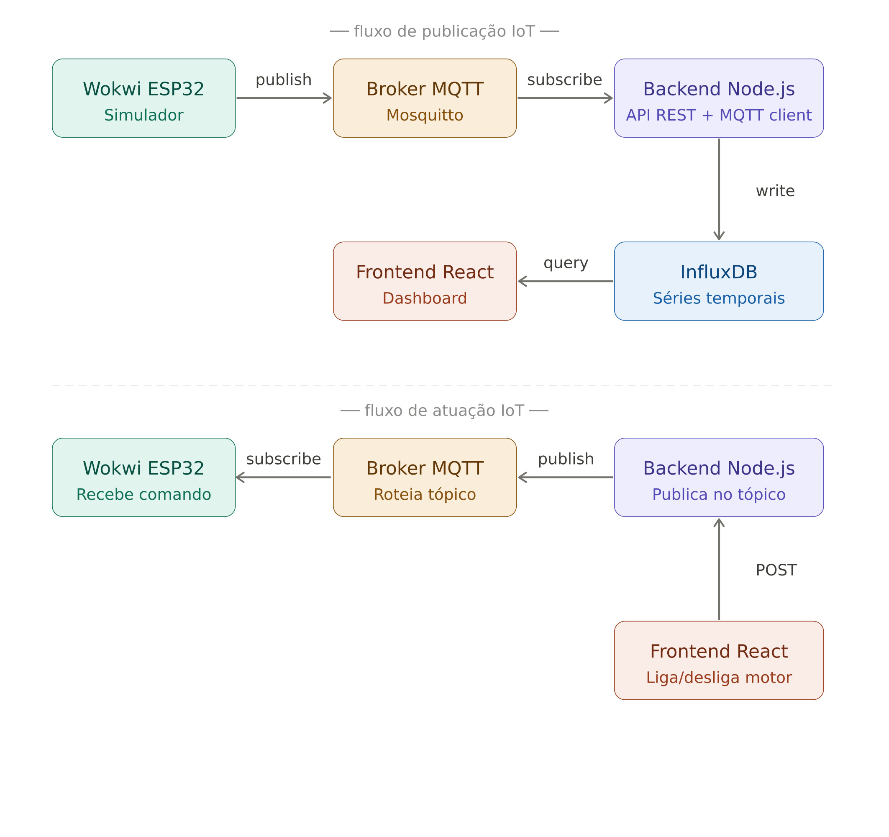
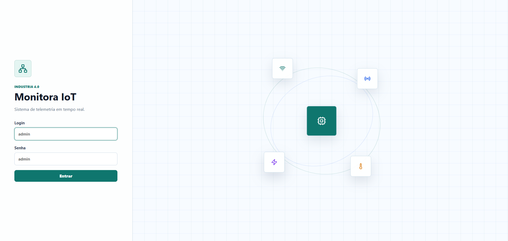
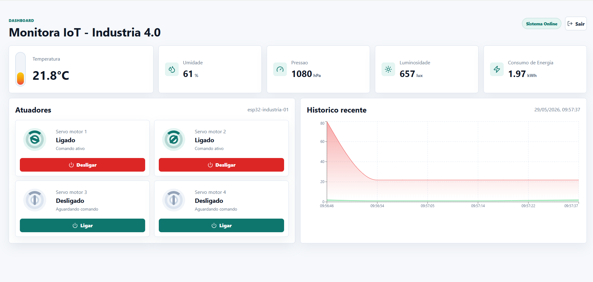
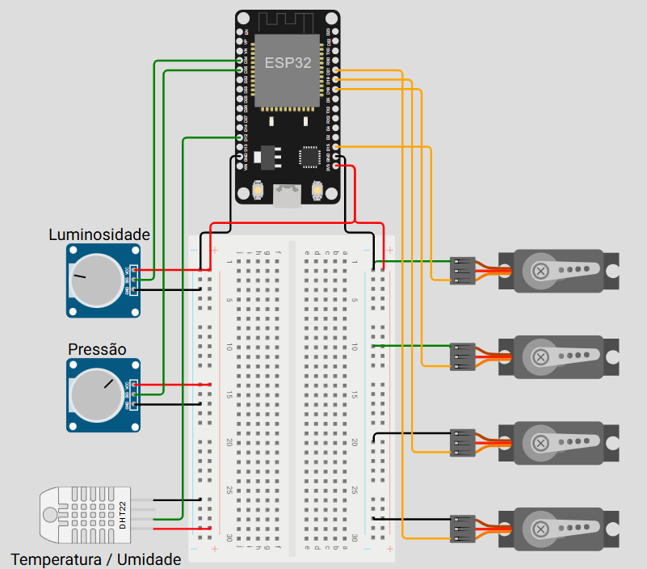

# Demo IoT Industria 4.0

Projeto demonstrativo com ESP32 simulado no Wokwi, broker MQTT local, InfluxDB local, backend Node.js e frontend React em tempo real. A ideia e rodar tudo na maquina do aluno, sem depender de broker MQTT ou banco de dados na internet.



## Resultado Esperado

Tela de login:



Dashboard em tempo real:



Simulador online de referencia:

https://wokwi.com/projects/465217495043863553

Simulador ESP32 no Wokwi:



## Componentes

```text
backend/   API Node.js, MQTT subscriber/publisher, InfluxDB e Socket.IO
broker/    Broker MQTT local em Python
frontend/  Login e dashboard IoT em React
imagens/   Imagens usadas neste README
influxdb/  InfluxDB local com interface web
wokwi/     Firmware ESP32, diagram.json e configuracao Wokwi
```

## Pre-Requisitos

Instale antes de comecar:

- Git
- Node.js LTS
- Python 3
- VS Code
- Extensao VS Code: Wokwi Simulator
- Wokwi CLI
- Arduino CLI ou o `arduino-cli.exe` que ja esta na pasta `wokwi`

Se estiver usando Git Bash no Windows, scripts `.ps1` devem ser executados com `powershell.exe`, como mostrado nos comandos abaixo.

## 1. Clonar o Repositorio

```bash
git clone <url-do-repositorio>
cd Mini-PI-IoT
```

## 2. Instalar as Dependencias Node.js

Backend:

```bash
cd backend
cp .env.example .env
npm install
cd ..
```

Frontend:

```bash
cd frontend
cp .env.example .env
npm install
cd ..
```

## 3. Instalar o InfluxDB Local

O InfluxDB fica dentro da pasta `influxdb`. Na primeira vez, execute:

Git Bash:

```bash
cd influxdb
powershell.exe -ExecutionPolicy Bypass -File ./install.ps1
cd ..
```

PowerShell:

```powershell
cd influxdb
.\install.ps1
cd ..
```

Esse comando baixa o InfluxDB OSS para Windows e coloca o binario em `influxdb/bin`.

## 4. Rodar Todos os Componentes

Use terminais separados. Mantenha cada processo aberto enquanto estiver usando o projeto.

### Terminal 1: InfluxDB

Git Bash:

```bash
cd influxdb
powershell.exe -ExecutionPolicy Bypass -File ./start.ps1
```

PowerShell:

```powershell
cd influxdb
.\start.ps1
```

Interface web do InfluxDB:

```text
http://localhost:8086
```

Credenciais:

```text
usuario: admin
senha: adminadmin
org: mini-pi-iot
bucket: iot
token: admin-token
```

Observacao: o InfluxDB 2.x rejeita senhas com menos de 8 caracteres, por isso a senha local e `adminadmin`.

### Terminal 2: Broker MQTT Local

```bash
cd broker
python broker.py
```

O broker escuta em:

```text
mqtt://localhost:1883
```

No Wokwi, o ESP32 acessa a maquina host por:

```text
host.wokwi.internal
```

### Terminal 3: Backend

```bash
cd backend
npm run dev
```

O backend fica em:

```text
http://localhost:3001
```

Teste rapido:

```text
http://localhost:3001/health
```

### Terminal 4: Frontend

```bash
cd frontend
npm run dev
```

Acesse:

```text
http://localhost:5173
```

Login do dashboard:

```text
usuario: admin
senha: admin
```

### Terminal 5: Wokwi Local

Para usar o Wokwi localmente no VS Code, instale:

- Extensao `Wokwi Simulator` no VS Code
- Wokwi CLI
- Arduino CLI ou use o `arduino-cli.exe` que ja esta na pasta `wokwi`

Instale o Wokwi CLI, se ainda nao tiver:

```bash
npm install -g wokwi-cli
```

Faca login no Wokwi CLI, se for a primeira vez usando na maquina:

```bash
wokwi-cli login
```

O projeto Wokwi usa estas dependencias Arduino, declaradas em `wokwi/libraries.txt`:

```text
PubSubClient
ArduinoJson
DHT sensor library
ESP32Servo
```

Ao compilar com `arduino-cli.exe`, instale o core ESP32 se ele ainda nao existir na maquina:

```bash
./arduino-cli.exe core update-index
./arduino-cli.exe core install esp32:esp32
```

Compile o firmware:

Git Bash:

```bash
cd wokwi
./arduino-cli.exe compile --fqbn esp32:esp32:esp32 --output-dir build/esp32.esp32.esp32 .
```

PowerShell:

```powershell
cd wokwi
.\arduino-cli.exe compile --fqbn esp32:esp32:esp32 --output-dir build/esp32.esp32.esp32 .
```

Depois execute o simulador:

```bash
wokwi-cli .
```

O arquivo `wokwi/wokwi.toml` aponta para:

```text
wokwi/build/esp32.esp32.esp32/wokwi.ino.elf
```

## Fluxo dos Dados

O ESP32 publica telemetria a cada 1 segundo no topico:

```text
industria40/sensores
```

O backend assina esse topico, grava as leituras no InfluxDB e envia os dados em tempo real para o frontend via Socket.IO.

Os comandos dos motores saem do frontend, passam pelo backend e sao publicados no topico:

```text
industria40/atuadores
```

## Dados Simulados

Analogicos:

- Temperatura
- Umidade
- Pressao
- Luminosidade
- Consumo de energia

Digitais e atuadores:

- Servo motor 1
- Servo motor 2
- Servo motor 3
- Servo motor 4

## Ordem Recomendada Para A Aula

1. Clone o repositorio.
2. Instale as dependencias do backend e frontend.
3. Instale o InfluxDB local com `install.ps1`.
4. Suba o InfluxDB com `start.ps1`.
5. Suba o broker MQTT local.
6. Suba o backend.
7. Suba o frontend.
8. Compile e execute o Wokwi.
9. Abra o dashboard e acione os motores.
10. Abra a interface do InfluxDB e confira as medicoes gravadas no bucket `iot`.

## Solucao de Problemas

Se `./install.ps1` mostrar erros como `command not found`, voce esta rodando PowerShell como se fosse Bash. Use:

```bash
powershell.exe -ExecutionPolicy Bypass -File ./install.ps1
```

Se o frontend mostrar `Sem conexao em tempo real`, confira se o backend esta rodando em `http://localhost:3001`.

Se nao houver dados no dashboard, confira se o broker esta aberto e se o Wokwi conseguiu conectar em `host.wokwi.internal:1883`.

Se o InfluxDB nao abrir, confira:

```text
influxdb/logs/influxd.err.log
```
